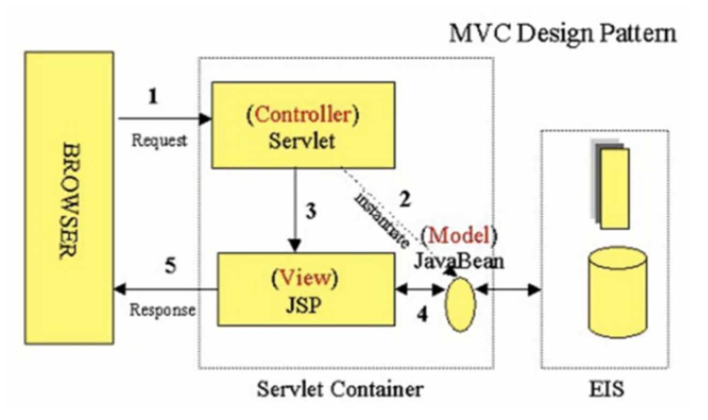
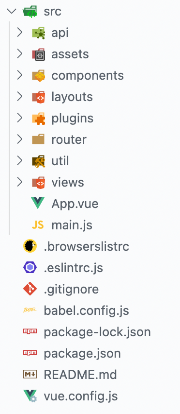

# 写在前面

鉴于67在上课时候并没有讲很多项目结构的东西，加上项目结构确实有点令人摸不着头脑，所以分工之前我觉得应该把个人的理解分享一下 ，帮助大家理解一下。个人见解，多多包涵。


## Web开发-发展过程

我觉得了解一个东西，了解它的历史是非常重要而且必要的，它的发展历程会帮助我们理解一个东西的由来以及如此设计的原因，所以先简要说一下发展历程。

### Java Web

其实最初的网页开发相对来说非常简单，没有这么多的框架，没有这么多的层、结构、包、依赖，等等等等。实际上最初的网页是静态网页，就是所有东西都是固定的，但是随着网页的发展，必须需要动态网页，举个最简单的例子，根据不同的账户去展示账户内的数据，这一点静态网页是肯定实现不了的，所以动态网页应运而生，也就是说，网页的内容并不是写死的，而是根据需求要动态去变化的，而最初的动态网页就是由Java去编写的，也就是Java Web项目。

Java Web项目没有严格的前端，其实所有的东西都是由后端去生成，然后返回给前端的，结构图如下：



这里需要了解的最重要的概念就是servlet，这也就相当于springboot中的controller，当一个浏览器的请求，比如Get请求或者Post请求到达时，servlet会根据你配置的响应的jsp代码去处理这个请求。好了，那jsp是什么，jsp全称叫Java Serve Page，说白了，就是用Java去生成html代码，然后把响应的html返回给浏览器。   

总结下就是，Java Web就是只有一个后端，其中的servlet接收请求后根据配置信息交给响应的jsp去处理，jsp通过请求携带的参数，比如用户id，去渲染响应的html，之后返回给浏览器。   

### Java Web的缺点

其实缺点应该比较明显，比如前端程序员几乎不用做事，所有的东西都是由后端程序员去做，这样显然是反人类的。并且，由于html中一大部分其实还是静态的，因为要变的东西毕竟是少数，所以jsp中的一大部分代码都是在输出html框架，比如：

```
print("<html>");
print("<head>");
print("<title> title</title>");
```

这里举个例子，想形容一下jsp做的大部分都是冗余的，不必要的，重复的。  

此外，这样写出来的程序耦合性非常大，简单来说就是牵一发而动全身，想修改项目，迭代项目是非常非常麻烦的。

## 前后端分离时代

那现在的网页开发方式就显得很合理，前后端分离，也就是说，前端只负责展示数据，专注于视图的渲染，而相比于之前的要向后端请求整个html页面（由jsp生成），现在的前端只需要向后端去请求数据即可，后端也只负责提供数据，这样的方式显然更好，分工合理， 耦合性低，便于维护。这样做的另一大有点就是跨平台变得更加方便了，以前后端要为不同的终端编写不同的html，但是现在只需要前端做变化就可以，后端只负责提供数据，不用管前端的事情。  

## 回到项目

所以我们课程的项目就是前后端分离，前端负责展示数据，后端负责提供数据，当然，现实中的大项目其实后端做的事情还有很多，比如什么负载均衡，高并发什么的，这个我也不懂就不说了。下面开始介绍一下前后端的项目结构。

### 前端

前端用的是Vue框架，所以Vue是肯定要去学习的，不过实在不会，并且没什么时间的话也没关系，大家只写后端也行。前端都由我来写也可以，但是结构还是要说一下。



如果嫌弃这个图就打开你们的编译器去对照这看一下。  

其实这么多东西看起来很复杂，其实没有，现代的项目基本上都是有配置+逻辑代码组成的。为什么要有配置呢，因为现在的框架很多，包括这个Vue，什么是框架？就是复用的代码，就是一堆代码，能达到很好的效果，所以我们拿来直接用，就不用重复造轮子了，但是仅仅有复用的代码肯定不够，因为我们有自己的需求，具体的代码需要变动，所以有了配置，我们把自己自定义的东西，特定的东西，通过框架给出的特定形式，填进去，让框架能够为我们自己的需求去服务，这就是配置。所以这个结构里面，有一些就是配置文件，比如以json结尾的。  

那么剩下的东西，vue文件就是最重要的，也是我们项目的核心代码，每一个Vue标签都有:

- <tamplate></tamplate>
- <script><script>
- <style></style>

这样三部分组成，也就对应了传统网页开发中的html，JavaScript，css。  

而项目中的views、layouts、components文件夹，里面其实都是vue文件，只是为了结构清晰，才把特定的一些vue文件放到相应的目录下。  

### 前端总结

其实最好的还是你们都去学一下，然后自己动手会清晰很多，不过由于各种原因，不学也可以，我要讲的就是这些。

## 后端结构

springboot还是比较火的后端框架，我先把之前画的结构图拿过来：


刚刚讲了，我们的后端其实就只有提供数据一个功能，所以分为的三层结构中：controller，service，dao（database access object）。

- controller负责接受请求并跳转到响应的service进行处理，就和刚刚 servlet和jsp差不多
- service层就是具体的处理逻辑，包括去调用数据库访问接口
- dao层就是具体的和数据库去打交道，写sql语句，但是由于项目中用了mybatis框架，所以要按照框架提供的方式去写mysql代码，去访问数据库。

其实我最初看到这三层结构的时候有些疑惑，这个service感觉没那么有用，为什么不直接去controller去调用dao接口？后来自己写了项目之后有了些许体会，就是有时候并不是直接访问数据库就能拿到数据，还有很多东西要处理，比如权限判断，或者说，根据前端的请求参数去获取查询条件等等，总而言之，service层还是很有必要的，因为其中有很多的业务逻辑，只是当项目比较简单时，看起来并不那么有用。

 **至于VO和PO只是不同层之间数据传递的形式，只是一种规定，都可以自己定制，就像http请求中有状态码，数据，响应头一样，不同层的数据传递也要有一定的形式，只不过这个形式由我们自己去定制。**

## 分工情况

说了这么半天，希望大家有所收获，做起项目来思路可以清晰一点，至少知道自己哪里不会，哪里不清楚，这样就有了明确的努力方向，学起来应该也会清晰很多，当然，如果还有任何问题都可以在群里讨论。

### 前端任务

前端任务先不着急，因为大家好像对Vue不是很熟悉，而且对课程来说，Vue不是那么重要，所以我先写，写不完再分锅。（嘻嘻）

### 后端任务

后端主要就是去写一些数据库的增删改查，因为本学期也有数据库课，所以我觉得这一部分大家还是要动动手，去了解一下实际情况中数据库到底有什么用，不要因为数据库课程比较理论而且讲的不太好，就忽视数据库的作用，其实数据库恰恰是很重要的一项技术。

这里我把一些接口规定一下，大家也是，自己领锅吧，没人领我再分。  

这次作业有两个功能，课程点赞和优惠券。所以在这里我先把接口定义好，这样比较规范。  

**注意一下，这里的接口，就是前端向后端请求的url路径。**  

比如课程点赞的接口，就是：localhost:8081/courselike/like/{userID}/{courseID}

#### 课程点赞接口

- Get: /courselike/like/{userID}/{courseID}  

  由于课程点赞，同时需要userID和courseID，所以把这两个参数同时发给后端，后端进行数据库写操作。如果成功，返回响应成功信息（可以自定义）

- Get: /courselike/dislike/{userID}/{courseID}

  同上，只不过这是取消点赞。

- Get: /courserlike/getLikeCourse/{userID}

  通过特定的userID，得到已经点赞的列表，返回这个列表。

### 优惠券接口

- Get: /coupon/student/getAll/{userID}/{courseID}

  根据userID和courseID获取可用的优惠券，返回可用优惠券列表，这是一个查操作

- Get: /coupon/student/useCoupon/{userID}/{courseID}

  使用优惠券，这是一个减操作

- Post: /coupon/student/createCoupon/{courseID}

  当学生购买时，发送此请求，用来发放和此课程相关的其他课程的优惠券。

- Post: /coupon/admin/createCoupon

  管理员创建优惠券。

  参数为：

  - type：int，优惠券类型，1表示满减型，2表示折扣型
  - condition：int，如果是满减携带这一参数，否则不带，给出满减的门槛
  - discount：int，如果是满减携带这一参数，表示折扣金额
  - percent：int，如果是折扣型，携带这一参数表示折扣比例
  - scale：int，作用范围类型，1：单个课程，2：某个学校课程，3：某个老师的课程
  - courseID：int,如果scale为1，携带课程id
  - schoolName: String,如果scale为2，携带学校名称
  - teacherName:String 如果scale为3，携带教师名称
  - startTime：date，起始时间
  - endTime：date，结束时间
  - number：int，优惠券数量。

  **注意，创建优惠券时，数据库中要有优惠券id**

- Post：/coupon/admin/check

  查看所有可发放的优惠券

- Post：/coupon/admin/provide

  参数为：

  - couponID：int，优惠券id
  - scale：int，1：特定用户， 2：发放给所有给此课程点赞过的用户， 3：发给购买过与此课程相关的课程的用户

  **这个发放优惠券是真的反人类，文档也写的不怎么样，真服了。**


**p.s.67文档最后的用户角色中的订单取消使用优惠券，就不写了，莫名其妙的，看不懂**


# 所以，总的项目分锅如下：

- 张潮越：前端
- 陈家志：后端优惠券接口编写
- 陈家伟：课程点赞接口和项目结构调整
- 林均劼：解决循环依赖

### **这是这周末的安排，下周我们再写具体的优惠券逻辑**


## p.s. 由于在项目中用了mybatis框架，所以大家还是要去学一下这个框架，也不是很难，只是在特定的xml文件中去写sql语句。

### [b站链接](https://www.bilibili.com/video/BV1NE411Q7Nx?from=search&seid=5528049731321059903)


## 写在最后

其实这个项目，还是有一定难度的，对我们现在的水平来说，因为框架的不熟悉，加上业务逻辑的复杂，写好还是要下很多功夫，我已经把我能做的都做了，希望帮助大家理解项目，减轻负担。任何问题都可以再群里讨论，而且讨论十分必要，因为这个项目一定要讨论才能够做好，有些东西可能我理解了但是表达不够清晰。·
